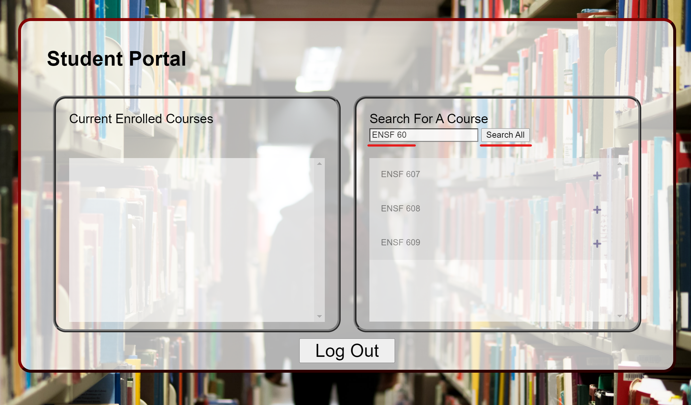
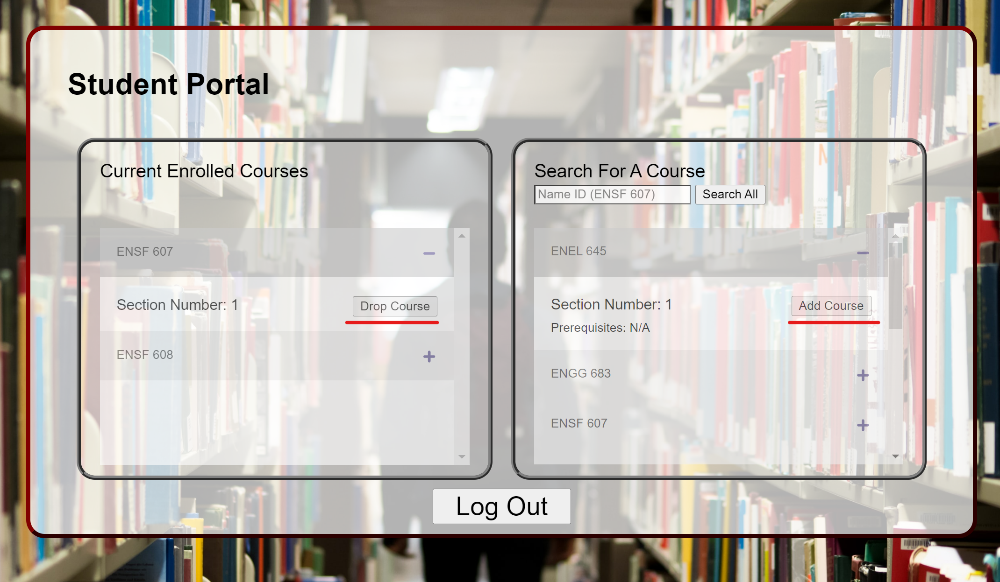
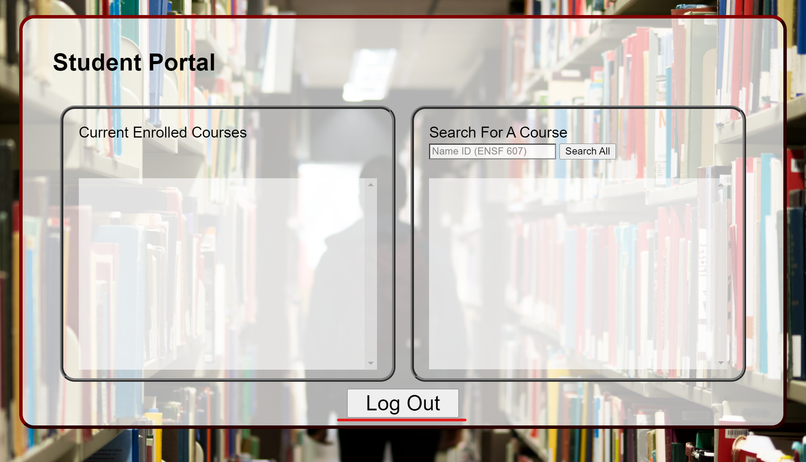
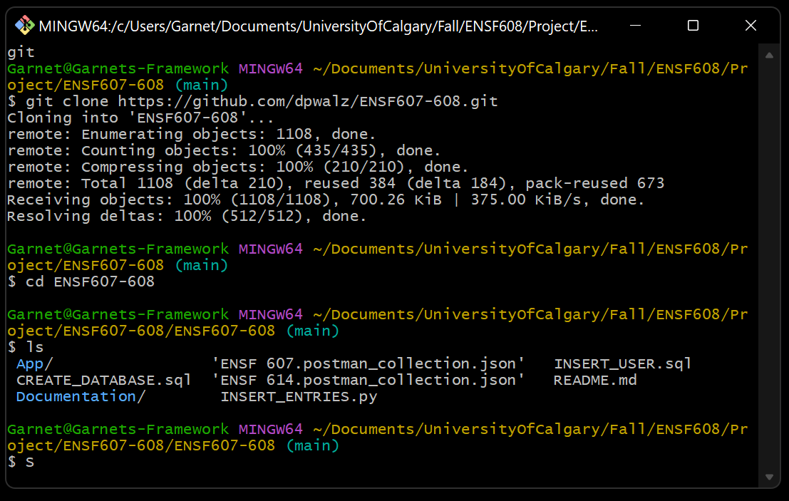
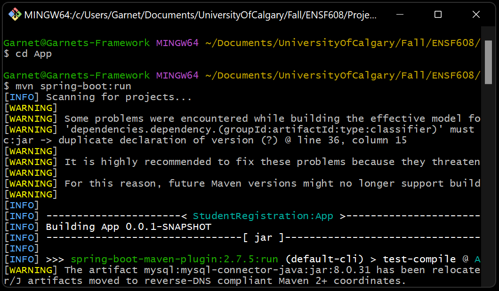
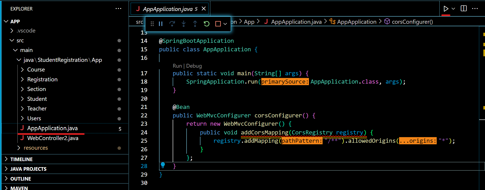

# ENSF 607-608

Authors:
- Garnet Crookes
- Ben Kaminski
- Derek Walz

Student Registration system created as a project for ENSF 607 and ENSF 608 Fall 2022

System allows a user to log in and register in, drop, or search for courses. Course database is created and stored on the backend. Front end was created using HTML/CSS/Javascript.All communication between backend and frontend is done using a rest API. Backend created in Spring-Boot 

## Example Functionality

### Login 

Can login with the following credentials

```
Username: test.user
Password: pass
```


### Search Courses

Can search for courses using the right display. Either press the button to view all courses or enter a search term to searched based on matching the LHS of the phrase

The search results are displayed in the box below the search bar



### Add/Drop Course

The courses are made using an accordian list. Openning a course will reveal and add or drop button. When adding a course all required checks will be done before the course is added




### Logout

Pressing the logout button will bring the user back to the main menu. When the same user logs back in their registered courses are still stored



## How to Run

## 1. Clone Git Repository:
	

Using Git Bash run the following commands:
```
git clone https://github.com/dpwalz/ENSF607-608.git

cd ENSF607-608
``` 
The main project code is contained in the ```App/``` Folder


	

## 2. Create Database:
	
- Run the [CREATE_DATABASE](CREATE_DATABASE.sql) script using MySQL Workbench.

- Database should be connected on port 3306

- Modify the spring.datasource.password file in the [application.properties](/App/src/main/resources/application.properties) file


## 3. Run Spring Boot Using Maven

### Option 1 Using Git Bash or other terminal

Run the following commands:
```
cd App
mvn clean install
mvn spring-boot:run
``` 



### Option 2 Code Editor such as Visual Studio Code

Open the folder App as a java project in any code editor

Run the file Application src/main/java/StudentRegistration/App/AppApplication.java




## 4. Open Website

- Using Any web browser navigate to ```http://localhost:8080/```